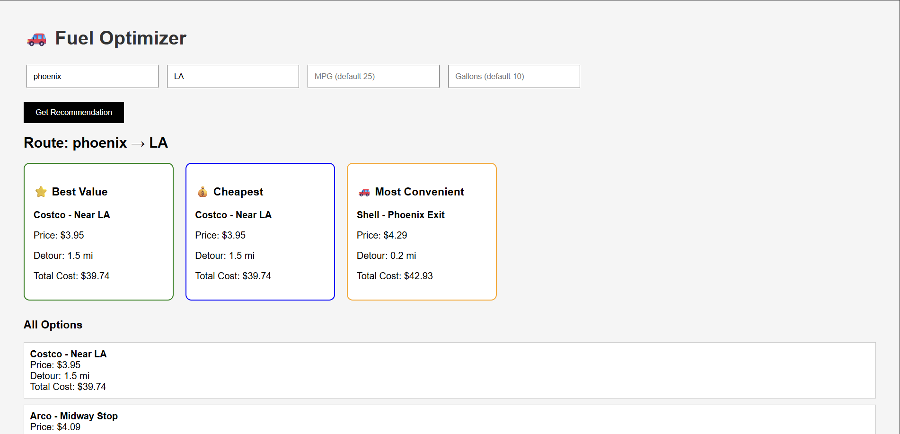

# 🚗 Fuel Optimizer

A smart web app that helps users find the best gas station along a route by balancing fuel price, detour distance, and total trip cost.

Instead of just showing the cheapest gas, this app answers the real question:

👉 "Where should I stop to save the most money overall?"

---

## 🔥 Features

- 📍 Enter Start and Destination
- ⛽ Get fuel price options along the route
- 🧠 Smart recommendations:
  - ⭐ Best Value (lowest total cost)
  - 💰 Cheapest (lowest price per gallon)
  - 🚗 Most Convenient (least detour)
- 📊 View all stations sorted by total cost
- 🌐 Simple frontend UI + FastAPI backend

---

## 🧠 How It Works

Total Cost = Fuel Cost + Detour Cost

Where:
- Fuel Cost = price × gallons
- Detour Cost = (detour miles ÷ MPG) × price

Then:
- Best Value → lowest total cost
- Cheapest → lowest price
- Most Convenient → lowest detour

---

## 🛠️ Tech Stack

Backend:
- Python
- FastAPI
- Uvicorn
- Requests

Frontend:
- HTML
- CSS
- JavaScript (Fetch API)

---

## 📁 Project Structure

fuel-optimizer/
│
├── backend/
│   ├── app/
│   │   ├── main.py
│   │   └── services/
│   │       ├── fuel_service.py
│   │       └── gas_api.py
│   ├── requirements.txt
│
├── frontend/
│   ├── index.html
│
└── README.md

---

## ⚙️ Setup Instructions

### 1. Clone Repo

git clone https://github.com/RushilManidhanJangala/fuel-optimizer.git  
cd fuel-optimizer

---

### 2. Backend Setup

cd backend  
python -m venv venv  

Activate:

Windows:
venv\Scripts\activate  

Mac/Linux:
source venv/bin/activate  

Install dependencies:

pip install -r requirements.txt  

Run server:

python -m uvicorn app.main:app --reload  

Backend runs on:
http://127.0.0.1:8000

---

### 3. Frontend

Open:

frontend/index.html

in browser (double click OR right click → open with browser)

---

## 🔌 API Endpoint

GET /recommendation

Example:

http://127.0.0.1:8000/recommendation?start=phoenix&destination=la&mpg=25&gallons=10

---

## 📸 Screenshot

---

## 🚀 Future Improvements

- Real gas price APIs integration
- Google Maps route integration
- Vehicle-based mileage optimization
- Live traffic-aware recommendations
- Deploy to cloud (AWS / Render)

---

## 💡 Why This Project?

Existing apps show:
- Cheapest gas ❌
- Nearest gas ❌

This project solves:
👉 Total trip cost optimization ✅

---

## 👨‍💻 Author

Rushil Manidhan Jangala